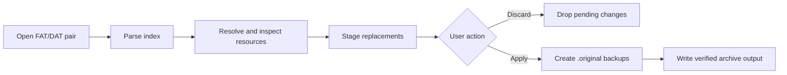

# Dunia Toolkit

Modding toolkit for the PC version of **Far Cry 5**, built with C#/.NET 9 and WPF.

The project aims to provide one safe application for browsing, extracting, inspecting, replacing, and rebuilding local Dunia 2 game resources. It targets offline game files only and does not interact with multiplayer services, anti-cheat, process memory, or a running game.

> [!WARNING]
> Archive writing is safety-gated. Always dry-run new replacements, keep verified `.original` backups, and close the game before Apply. FCB and XBT writes have passed real game-load validation.

## What it does

- Browse Far Cry 5 `.fat`/`.dat` archive pairs without unpacking the entire game.
- Search for resources across related archives.
- Extract individual files or complete archives.
- Inspect and round-trip FCB (`FarCryBinary`) trees with hash-to-name resolution.
- Preview every `.xbt` mip level with RGBA/RGB/R/G/B/A channel isolation and export DDS/PNG data.
- Preview supported `.xbg` meshes, inspect material references, switch LODs in an interactive 3D viewport, and export verified static geometry to FBX 7.4.
- Replace textures with automatic validation and conversion.
- Stage modifications in memory before writing anything to disk.
- Show every pending change and support explicit **Apply** or **Discard** actions.
- Create permanent `.original` backups before the first archive write.
- Expose the supported workflows through one WPF application.

Skinning/skeleton export, XBM mutation, and specialized weather/time-of-day editing remain unsupported after the Phase 6 recon gate found no verified clean-room schemas. Unsupported layouts are rejected explicitly.

## How Dunia archives work

Far Cry 5 stores most resources in archive pairs:

- `.fat` contains the archive index and metadata.
- `.dat` contains the resource payloads.
- File paths are commonly represented by hashes.
- Payloads may be stored uncompressed or compressed, including LZ4-era variants.
- FC5 and Far Cry New Dawn use FAT format version 10.

The toolkit keeps format handling separate from presentation and applies changes through a staged transaction:



No write should occur while browsing, extracting, previewing, or staging a replacement.

## Safety model

Before the first write to an archive file, the toolkit creates:

```text
patch.fat          -> patch.fat.original
patch.dat          -> patch.dat.original
```

An existing `.original` file is never overwritten. Backup publication is atomic, concurrent calls create exactly one backup, and temporary files are removed after success, failure, or cancellation.

In-place writes require explicit confirmation, expected resource hashes, a stable source-pair fingerprint, verified `.original` backups, post-publication validation, and rollback on any failure. The game must be closed before applying changes.

## Current status

| Area | Status |
|---|---|
| .NET 9 solution and project boundaries | Implemented |
| FAT prefix recon probe | Implemented |
| Validated FAT v10 envelope/entry-count reader | Implemented |
| FAT v10 entry metadata reader | Implemented |
| Atomic `.original` backup primitive | Implemented |
| Complete FAT/DAT pair backup preflight | Implemented |
| Pending-change set with Apply/Discard foundations | Implemented |
| SHA-256 verified replacement staging | Implemented |
| FAT v10 entry parser | Implemented and validated against all 16 local FC5 indexes |
| FAT v10 index writer | Implemented; byte-exact synthetic round-trip covered |
| Append-only FAT/DAT patch builder | Implemented with safe new-pair and transactional in-place publication |
| Validated rebuild-to-new-pair file service | Implemented; never overwrites existing files |
| Transactional in-place Apply service | Implemented; source-pair locking and SHA-256 stability checks included |
| Confirmed in-place CLI Apply | Implemented; requires index plus expected hash |
| Confirmed transactional archive restore | Implemented; requires both expected backup SHA-256 values |
| CLI Apply dry-run | Implemented; builds and validates without modifying the source |
| CLI byte-exact FAT/DAT round-trip verification | Implemented |
| Real FC5 no-change FAT/DAT round-trip | Validated byte-exact on empty and compressed archive pairs |
| Replacement semantic round-trip verifier | Implemented |
| Real FC5 LZ4 replacement round-trip | Validated on `common` entry 0 |
| FC5 CRC64 path hashing and name-list resolver | Implemented |
| Uncompressed DAT payload extraction | Implemented |
| LZ4 DAT payload extraction | Implemented |
| FAT/DAT extraction and rebuilding | Safe rebuild-to-new-pair and verified in-place Apply implemented |
| FCB v2 parser | Implemented and validated on a real FC5 fixture |
| FCB archive signature scanner | Implemented |
| FCB v2 writer and byte-exact verifier | Implemented; validated on uncompressed and LZ4-backed real FC5 fixtures |
| FCB CRC32 hashing, name resolution, coverage audit, and binary discovery | Implemented; unresolved hashes remain explicit |
| Archive-wide FCB analysis and name discovery | Implemented; validated across real `common.fat` |
| Read-only FCB typed value projections | Implemented; ambiguity and evidence are explicit |
| External FCB value schema and coverage gate | Implemented; real entry 93 resolves 6/6 fields |
| Schema-gated FCB field mutation | Implemented in the format library and atomic write-new CLI |
| FCB mutation FAT/DAT dry-run | Implemented; validated against real `common.fat` entry 93 |
| Verified FCB mutation archive copy | Implemented; source remains read-only and destination must be new |
| Confirmed in-place FCB archive mutation | Implemented and game-load validated; requires `--confirm-write` |
| Read-only FCB mutation plan | Implemented; reports typed values, encoded bytes, hashes, coverage, and no-op state |
| Atomic multi-field FCB mutation | Implemented for planning, dry-run, and confirmed in-place Apply |
| FCB mutation template generator | Implemented; emits byte-exact no-op TSV without overwriting outputs |
| Multi-entry FCB archive transaction API v1 | Implemented and contract-frozen for WPF integration |
| WPF schema-gated FCB transaction workspace | Implemented for one or more selected entries; Plan, Dry-run, Copy, Apply, and Discard use API v1 |
| XBT → DDS extraction | Implemented |
| DDS → XBT import | Implemented with byte-exact wrapper preservation and strict layout validation |
| PNG → DDS/XBT re-encode | Implemented for validated 2D BC1/BC2/BC3/BC4/BC5/BC7 DXGI templates |
| FC5 XBG geometry decoder | Implemented for validated multi-buffer layouts and every declared LOD; safety-gated |
| FBX 7.4 static mesh export | Implemented for every decoded LOD, section, normal, UV, and material reference |
| WPF mesh viewer | Implemented with material references, FBX export, LOD selection, orbit, pan, zoom, fit-to-view, and keyboard controls |
| CLI archive, texture, FCB, mip, mesh, pack, reference, hash, and verification commands | Implemented |
| Directory pack and resource-reference CLI commands | Implemented with exact replacement validation and bounded streaming scans |
| WPF archive browser | Implemented with paging, search, name discovery, Pack, reference scanning, staged multi-texture Apply/Discard, and mesh preview |
| Phase 0 recon | Complete; FAT v10, raw LZ4, independent extraction, real game load, and restore validated |
| Phase 1 archive layer | Complete; byte-exact rebuild, transactional Apply, immutable backups, rollback, and restore |
| Phase 2 FCB layer | Complete; byte-exact round-trip and schema-gated multi-entry transactions in CLI and WPF |
| Phase 3 texture layer | Complete; visibly modified BC3/XBT replacement passed real in-game render validation |
| Phase 4 CLI | Complete; advertised verb contract and safety invariants are test-covered |
| Phase 5 GUI | Complete; archive, texture, FCB, reference, pack, and mesh workflows use shared safety boundaries |
| Phase 6 stretch recon | Complete; mesh viewer, material references, and static FBX export implemented; unverified mutation schemas fail closed |

The authoritative technical handoff is in [`dunia-toolkit-fc5-spec.md`](dunia-toolkit-fc5-spec.md). Recon findings and acceptance gates are tracked in [`docs/recon/phase-0.md`](docs/recon/phase-0.md).

## Solution layout

```text
DuniaToolkit.slnx
├── Dunia.Formats/        FAT/DAT, FCB, hashing, and texture codecs; no UI dependencies
├── Dunia.Formats.Tests/  Format, round-trip, concurrency, and safety tests
├── Dunia.Cli/            Command-line interface and recon utilities
└── Dunia.Toolkit/        Windows WPF application
```

`Dunia.Formats` must remain independent of WPF so the same verified implementation is used by the GUI, CLI, and tests.

## Requirements

- Windows 10 or newer
- [.NET 9 Desktop Runtime](https://dotnet.microsoft.com/download/dotnet/9.0) for the release build
- .NET 9 SDK or newer only when building from source

## Using the application

1. Extract the release ZIP.
2. Open the `gui` directory and run `Dunia.Toolkit.exe`.
3. Select a Far Cry 5 `.fat` archive; the matching `.dat` file is detected automatically.
4. Browse, preview, extract, or stage supported changes in the application.
5. Use Dry-run before Apply and keep the generated `.original` backups.

## Build and test

```powershell
dotnet build DuniaToolkit.slnx --configuration Release
dotnet test DuniaToolkit.slnx --configuration Release
```

Warnings are treated as errors.

## Implemented library surface

- `ArchiveBackupService` atomically creates one permanent `.original` backup and verifies its SHA-256 before publication.
- `ArchivePairBackupService` validates and backs up a complete FAT/DAT pair.
- `PendingChangeSet<TKey, TChange>` provides ordered, thread-safe staging and discard snapshots.
- `ReplacementStagingStore` snapshots replacement files and verifies their length and SHA-256 before use.
- `FatPrefixProbe` reports raw archive prefix evidence without assuming an unverified FAT v10 layout.
- `FatV10IndexSummaryReader` validates the confirmed 24-byte header, 20-byte entry envelope, and 8-byte trailer.
- `FatV10IndexReader` decodes hashes, sizes, offsets, encryption flags, and LZ4/none metadata with paired-DAT bounds checks.
- `FatV10IndexWriter` validates packed-field limits and serializes the confirmed FAT v10 envelope and entries.
- `FatV10ArchivePatchBuilder` preserves the original DAT byte-for-byte, appends verified replacements, and rewrites only affected FAT metadata into separate outputs.
- `FatV10ArchivePatchFileBuilder` durably writes, reparses, and publishes a new archive pair without modifying the source pair or overwriting existing outputs.
- `FatV10ArchivePatchApplyService` locks and fingerprints the source pair, builds first, creates permanent backups, rechecks the rollback pair before publication, and validates the live pair before deleting rollback files.
- `DuniaCrc64` and `DuniaNameResolver` compute normalized FC5 path hashes and resolve all matching name candidates without guessing.
- `DuniaCrc32` and `FcbNameResolver` resolve case-sensitive FCB type/field hashes from text lists or Dunia `binary_classes.xml` definitions.
- `FcbReader` parses FCB v2 headers, raw hash-keyed fields, backward value references, and shared child pointers.
- `FcbWriter` preserves field order, header counters, backward value references, and shared child pointers.
- `FcbRoundTripVerifier` requires read/write SHA-256 equality before an FCB resource is accepted for editing.
- `FcbArchiveScanner` locates FCB payloads inside FAT/DAT pairs without requiring resolved filenames.
- `FcbArchiveAnalyzer` parses every eligible FCB payload in one archive pass and aggregates type/field hash occurrences.
- `FcbNameDiscovery` scans printable binary identifiers only against hashes present in a selected FCB and retains source offsets as evidence.
- `FcbValueProjector` exposes raw hex plus structural or size-compatible string, boolean, integer, IEEE-754, and vector candidates without mutating fields.
- `FcbValueSchema` maps exact `(node type hash, field hash)` pairs to codecs and rejects malformed or conflicting definitions.
- `FcbTypedValueProjector` resolves only schema-selected compatible candidates; `FcbValueSchemaCoverageAnalyzer` blocks incomplete or incompatible schemas.
- `FcbValueMutator` clones the graph, updates inline values and their references, then requires schema coverage and byte-exact serialize/reparse stability.
- `FcbValueEncoder` canonically encodes schema-selected scalar, hash, string, and vector values in little-endian form.
- `FcbArchiveMutationDryRunService` rebuilds a temporary FAT/DAT pair, re-extracts the changed payload, and verifies untouched entries plus the complete source DAT prefix.
- `FcbArchiveMutationCopyService` requires a successful dry-run, reproduces the same payload hash, publishes a new archive pair, and independently re-extracts the result before success.
- `FcbArchiveMutationPlanService` predicts the verified payload entirely in memory and reports canonical typed values, complete schema coverage, exact hashes, and semantic no-op state without staging or writes. Confirmed apply short-circuits reported no-ops before dry-run, backup, staging, or rebuild.
- `FcbArchiveBatchMutationPlanService`, `FcbArchiveBatchMutationDryRunService`, and `FcbArchiveBatchMutationApplyService` validate a tab-separated mutation set, encode and apply all fields in one graph transaction, and publish one semantically verified replacement payload.
- `FcbArchiveMutationManifestService` projects every independently editable inline field into a byte-exact no-op template with source payload SHA-256; referenced fields are counted and excluded.
- `FcbArchiveTransactionService` is the stable API v1 facade for multi-entry Plan, Dry-run, Copy, and Apply; one plan hash binds every targeted source and planned payload before one archive transaction.
- `FatV10ArchivePatchApplyService` re-extracts and hashes every published replacement, then executes optional semantic validation while rollback files still exist; validation failures restore both original archive files.
- `FatV10ArchiveRestoreService` validates immutable `.original` hashes, stages and validates the backup pair, then restores both files transactionally without deleting the backups.
- `FatV10PayloadExtractor` streams validated uncompressed payloads and decodes raw LZ4 blocks with exact output-size verification.
- `XbtDdsExtractor` strips the XBT wrapper and streams the embedded DDS payload to an output stream.
- `XbtDdsImporter` preserves the template XBT wrapper byte-for-byte and accepts only a DDS with identical dimensions, mip topology, pixel format, and payload length.
- `XbtPngExporter` and `XbtPngImporter` provide CRC-validated 8-bit PNG conversion with template-driven DXGI compression and mip generation.
- `XbtMipDecoder` decodes bounded complete mip chains; `XbtMipPngWriter` exports any selected level as a CRC-protected RGBA PNG.
- `XbtArchiveReplacementService` binds Plan, Dry-run, Copy, and Apply to exact source/replacement hashes and validates the published XBT before committing a transaction.
- `XbtArchiveTransactionService` binds multiple staged XBT replacements to one deterministic plan hash, revalidates the source under the archive lock, and validates every published texture before rollback removal.
- `FatV10DirectoryPackService` maps normalized relative paths to archive CRC64 identities, stages every input, rebuilds a new pair, and verifies every published replacement.
- `DuniaResourceReferenceScanner` finds archive resource hashes in binary payloads across streaming buffer boundaries in little- and big-endian layouts.
- `XbgMeshPreviewReader` validates FC5 SDOL bounds, decodes multi-buffer vertex/index data, and exposes every declared LOD without WPF dependencies.
- `XbgFbxExporter` validates complete geometry before emitting deterministic FBX 7.4 with LOD and material metadata.

## Correctness requirements

There is no complete independent FC5 format specification. Correctness therefore depends on fixture-based verification:

1. Extract the same unmodified archive with two independent established tools.
2. Compare every extracted file by SHA-256, not only by name or size.
3. Annotate the observed FAT v10 fields and compression framing.
4. Implement the smallest confirmed reader surface.
5. Require `read -> write -> byte comparison` to produce zero differences.
6. Enable archive writes only after round-trip and failure-path tests pass.

Game-derived fixtures must remain local. Do not commit Ubisoft assets, extracted resources, or proprietary reference binaries.

## Limitations

- Only confirmed Far Cry 5 FAT v10 layouts are writable. Unknown versions, encrypted entries, SubFAT layouts, and unsupported compression modes fail closed.
- XBG decoding covers validated FC5 geometry layouts. Unsupported vertex layouts are rejected; skinning, skeletons, animations, collision, and XBG re-encoding are not supported.
- FBX export contains static geometry, all decoded LODs, normals, UVs, sections, and material references. It does not contain rigs or skin weights.
- Material inspection exposes verified LTMR slot names and paths only. XBM parameter mutation and automatic material/texture reconstruction are not supported.
- Weather and time-of-day have no verified FC5 curve schema, so no specialized editor is provided. Confirmed fields can still be edited through the schema-gated FCB workspace.
- PNG import is limited to validated 2D BC1/BC2/BC3/BC4/BC5/BC7 templates; arrays, cubemaps, volumes, HDR, interlaced PNGs, and unsupported layouts are rejected.
- Name resolution depends on user-supplied or bundled clean-room name catalogs. Unknown hashes remain explicit and are never guessed.
- Published binaries are framework-dependent and require the .NET 9 Desktop Runtime on Windows 10 or newer.
- Archive modification is inherently risky. Close the game, run Dry-run first, retain `.original` backups, and never use the toolkit against multiplayer services or a running process.

## License

Dunia Toolkit is released under the [MIT License](LICENSE). Third-party components and adapted permissive references retain their own notices in [THIRD_PARTY_NOTICES.md](THIRD_PARTY_NOTICES.md).

## Prior art and licensing

- [Gibbed.Dunia](https://github.com/gibbed/Gibbed.Dunia) is zlib-licensed and provides explicit FAT v10/v11 serializers plus FC5 pack/unpack projects.
- [Gibbed.Dunia2](https://github.com/gibbed/Gibbed.Dunia2) is the legacy zlib-licensed baseline through FAT v9.
- [FCBConverter](https://github.com/JakubMarecek/FCBConverter) supports later Far Cry games but is GPLv3. Treat it as a behavioral oracle unless this project explicitly adopts GPLv3.
- [FC5ArchiveViewer](https://github.com/JakubMarecek/FC5ArchiveViewer) is GPLv3 and must not be copied into a permissively licensed implementation.
- [WildlandsToolkit](https://github.com/AlphaGlyph1371/WildlandsToolkit) provides architecture and UX inspiration only; its `.forge` parsing code is unrelated to Dunia FAT/DAT archives.

Project code is licensed under MIT. Third-party notices must remain included in source and binary distributions.

## Disclaimer

This is an unofficial community project and is not affiliated with or endorsed by Ubisoft. Keep verified backups of original game files and use modifications at your own risk.
