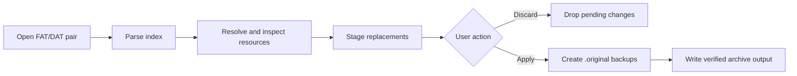

# Dunia Toolkit

Work-in-progress modding toolkit for the PC version of **Far Cry 5**, built with C#/.NET 9 and WPF.

The project aims to provide one safe application for browsing, extracting, inspecting, replacing, and rebuilding local Dunia 2 game resources. It targets offline game files only and does not interact with multiplayer services, anti-cheat, process memory, or a running game.

> [!WARNING]
> Archive writing remains experimental. Validate replacements with `apply --dry-run` and use copied archives until the modified pair has passed an actual game-load test.

## What it will do

- Browse Far Cry 5 `.fat`/`.dat` archive pairs without unpacking the entire game.
- Search for resources across related archives.
- Extract individual files or complete archives.
- Inspect and round-trip FCB (`FarCryBinary`) trees with hash-to-name resolution.
- Preview `.xbt` textures and export their embedded DDS data.
- Replace textures with automatic validation and conversion.
- Stage modifications in memory before writing anything to disk.
- Show every pending change and support explicit **Apply** or **Discard** actions.
- Create permanent `.original` backups before the first archive write.
- Expose the same core operations through a WPF application and CLI.

Mesh viewing, FBX export, materials, weather, and time-of-day editing are research targets. They are not promised features until their FC5 formats are understood and verified.

## How Dunia archives work

Far Cry 5 stores most resources in archive pairs:

- `.fat` contains the archive index and metadata.
- `.dat` contains the resource payloads.
- File paths are commonly represented by hashes.
- Payloads may be stored uncompressed or compressed, including LZ4-era variants.
- FC5 and Far Cry New Dawn use FAT format version 10.

The toolkit keeps format handling separate from presentation and applies changes through a staged transaction:



No write should occur while browsing, extracting, previewing, or staging a replacement.

## Safety model

Before the first write to an archive file, the toolkit creates:

```text
patch.fat          -> patch.fat.original
patch.dat          -> patch.dat.original
```

An existing `.original` file is never overwritten. Backup publication is atomic, concurrent calls create exactly one backup, and temporary files are removed after success, failure, or cancellation.

In-place CLI writes remain disabled until archives containing replacements are independently validated. No-change FAT/DAT rebuilding now passes byte-exact SHA-256 round-trips against real empty and compressed FC5 archive pairs.

## Current status

| Area | Status |
|---|---|
| .NET 9 solution and project boundaries | Implemented |
| FAT prefix recon probe | Implemented |
| Validated FAT v10 envelope/entry-count reader | Implemented |
| FAT v10 entry metadata reader | Implemented |
| Atomic `.original` backup primitive | Implemented |
| Complete FAT/DAT pair backup preflight | Implemented |
| Pending-change set with Apply/Discard foundations | Implemented |
| SHA-256 verified replacement staging | Implemented |
| FAT v10 entry parser | Implemented and validated against all 16 local FC5 indexes |
| FAT v10 index writer | Implemented; byte-exact synthetic round-trip covered |
| Append-only FAT/DAT patch builder | Implemented; production publication still disabled |
| Validated rebuild-to-new-pair file service | Implemented; never overwrites existing files |
| Transactional in-place Apply service | Implemented and tested |
| Confirmed in-place CLI Apply | Implemented; requires index plus expected hash |
| CLI Apply dry-run | Implemented; builds and validates without modifying the source |
| CLI byte-exact FAT/DAT round-trip verification | Implemented |
| Real FC5 no-change FAT/DAT round-trip | Validated byte-exact on empty and compressed archive pairs |
| Replacement semantic round-trip verifier | Implemented |
| Real FC5 LZ4 replacement round-trip | Validated on `common` entry 0 |
| FC5 CRC64 path hashing and name-list resolver | Implemented |
| Uncompressed DAT payload extraction | Implemented |
| LZ4 DAT payload extraction | Implemented |
| FAT/DAT extraction and rebuilding | Safe rebuild-to-new-pair implemented; in-place apply disabled |
| FCB v2 parser | Implemented and validated on a real FC5 fixture |
| FCB archive signature scanner | Implemented |
| FCB v2 writer and byte-exact verifier | Implemented; validated on uncompressed and LZ4-backed real FC5 fixtures |
| FCB CRC32 hashing, name resolution, coverage audit, and binary discovery | Implemented; unresolved hashes remain explicit |
| Archive-wide FCB analysis and name discovery | Implemented; validated across real `common.fat` |
| Read-only FCB typed value projections | Implemented; ambiguity and evidence are explicit |
| External FCB value schema and coverage gate | Implemented; real entry 93 resolves 6/6 fields |
| Schema-gated FCB field mutation | Implemented in the format library and atomic write-new CLI |
| FCB mutation FAT/DAT dry-run | Implemented; validated against real `common.fat` entry 93 |
| Verified FCB mutation archive copy | Implemented; source remains read-only and destination must be new |
| XBT → DDS extraction | Implemented |
| DDS/PNG → XBT import and re-encode | Not implemented |
| CLI `probe`, `list`, `get`, and `tex extract` commands | Implemented |
| Remaining production CLI commands | Not implemented |
| WPF archive browser | Not implemented |

The authoritative technical handoff is in [`dunia-toolkit-fc5-spec.md`](dunia-toolkit-fc5-spec.md). Recon findings and acceptance gates are tracked in [`docs/recon/phase-0.md`](docs/recon/phase-0.md).

## Solution layout

```text
DuniaToolkit.slnx
├── Dunia.Formats/        FAT/DAT, FCB, hashing, and texture codecs; no UI dependencies
├── Dunia.Formats.Tests/  Format, round-trip, concurrency, and safety tests
├── Dunia.Cli/            Command-line interface and recon utilities
└── Dunia.Toolkit/        Windows WPF application
```

`Dunia.Formats` must remain independent of WPF so the same verified implementation is used by the GUI, CLI, and tests.

## Requirements

- Windows 10 or newer
- [.NET 9 SDK](https://dotnet.microsoft.com/download/dotnet/9.0) or a newer SDK capable of targeting .NET 9

## Build and test

```powershell
dotnet build DuniaToolkit.slnx --configuration Release
dotnet test DuniaToolkit.slnx --configuration Release
```

Warnings are treated as errors.

## Implemented library surface

- `ArchiveBackupService` atomically creates one permanent `.original` backup and verifies its SHA-256 before publication.
- `ArchivePairBackupService` validates and backs up a complete FAT/DAT pair.
- `PendingChangeSet<TKey, TChange>` provides ordered, thread-safe staging and discard snapshots.
- `ReplacementStagingStore` snapshots replacement files and verifies their length and SHA-256 before use.
- `FatPrefixProbe` reports raw archive prefix evidence without assuming an unverified FAT v10 layout.
- `FatV10IndexSummaryReader` validates the confirmed 24-byte header, 20-byte entry envelope, and 8-byte trailer.
- `FatV10IndexReader` decodes hashes, sizes, offsets, encryption flags, and LZ4/none metadata with paired-DAT bounds checks.
- `FatV10IndexWriter` validates packed-field limits and serializes the confirmed FAT v10 envelope and entries.
- `FatV10ArchivePatchBuilder` preserves the original DAT byte-for-byte, appends verified replacements, and rewrites only affected FAT metadata into separate outputs.
- `FatV10ArchivePatchFileBuilder` durably writes, reparses, and publishes a new archive pair without modifying the source pair or overwriting existing outputs.
- `FatV10ArchivePatchApplyService` builds first, creates permanent backups, publishes both files with rollback, and validates the live pair before deleting rollback files.
- `DuniaCrc64` and `DuniaNameResolver` compute normalized FC5 path hashes and resolve all matching name candidates without guessing.
- `DuniaCrc32` and `FcbNameResolver` resolve case-sensitive FCB type/field hashes from text lists or Dunia `binary_classes.xml` definitions.
- `FcbReader` parses FCB v2 headers, raw hash-keyed fields, backward value references, and shared child pointers.
- `FcbWriter` preserves field order, header counters, backward value references, and shared child pointers.
- `FcbRoundTripVerifier` requires read/write SHA-256 equality before an FCB resource is accepted for editing.
- `FcbArchiveScanner` locates FCB payloads inside FAT/DAT pairs without requiring resolved filenames.
- `FcbArchiveAnalyzer` parses every eligible FCB payload in one archive pass and aggregates type/field hash occurrences.
- `FcbNameDiscovery` scans printable binary identifiers only against hashes present in a selected FCB and retains source offsets as evidence.
- `FcbValueProjector` exposes raw hex plus structural or size-compatible string, boolean, integer, IEEE-754, and vector candidates without mutating fields.
- `FcbValueSchema` maps exact `(node type hash, field hash)` pairs to codecs and rejects malformed or conflicting definitions.
- `FcbTypedValueProjector` resolves only schema-selected compatible candidates; `FcbValueSchemaCoverageAnalyzer` blocks incomplete or incompatible schemas.
- `FcbValueMutator` clones the graph, updates inline values and their references, then requires schema coverage and byte-exact serialize/reparse stability.
- `FcbValueEncoder` canonically encodes schema-selected scalar, hash, string, and vector values in little-endian form.
- `FcbArchiveMutationDryRunService` rebuilds a temporary FAT/DAT pair, re-extracts the changed payload, and verifies untouched entries plus the complete source DAT prefix.
- `FcbArchiveMutationCopyService` requires a successful dry-run, reproduces the same payload hash, publishes a new archive pair, and independently re-extracts the result before success.
- `FatV10ArchivePatchApplyService` executes optional semantic validation after publication while rollback files still exist; validation failures restore both original archive files.
- `FatV10PayloadExtractor` streams validated uncompressed payloads and decodes raw LZ4 blocks with exact output-size verification.
- `XbtDdsExtractor` strips the XBT wrapper and streams the embedded DDS payload to an output stream.

## Archive inspection

Inspect and validate a FAT v10 index plus its adjacent DAT payload:

```powershell
dotnet run --project Dunia.Cli -- probe "D:\Games\Far Cry 5\data_final\pc\patch.fat"
```

List decoded entries. The default limit is 100; every entry is still parsed and checked against the paired DAT before output:

```powershell
dotnet run --project Dunia.Cli -- list "D:\Games\Far Cry 5\data_final\pc\common.fat" --limit 25
```

Extract one entry by its zero-based index. Existing output files are never overwritten:

```powershell
dotnet run --project Dunia.Cli -- get "D:\Games\Far Cry 5\data_final\pc\common.fat" 0 "entry-0.bin"
```

Build a separate archive pair with one or more uncompressed replacements. Source and existing output files are never modified:

```powershell
dotnet run --project Dunia.Cli -- rebuild "common.fat" "common.modified.fat" 12 "replacement.bin" 42 "other.bin"
dotnet run --project Dunia.Cli -- apply "common.fat" --dry-run 12 "replacement.bin"
dotnet run --project Dunia.Cli -- apply "common-copy.fat" --confirm-write 12 0123456789ABCDEF "replacement.bin"
dotnet run --project Dunia.Cli -- verify roundtrip "common.fat"
dotnet run --project Dunia.Cli -- verify replacement "common.fat" 0
```

Example output shape:

```text
path=D:\Games\Far Cry 5\data_final\pc\patch.fat
length=...
magic.ascii=...
version.le=...
version.be=...
prefix.hex=...
```

Extract a DDS payload without overwriting an existing output file:

```powershell
dotnet run --project Dunia.Cli -- tex extract "input.xbt" "output.dds"
```

Planned CLI verbs are `pack` and `refs`. They are displayed in help output but intentionally return an unavailable-command error until implemented and tested.

Compute a normalized FC5 resource-path CRC64 or resolve one from a local one-path-per-line name list:

```powershell
dotnet run --project Dunia.Cli -- hash compute "graphics\example.xbt"
dotnet run --project Dunia.Cli -- hash resolve 0123456789ABCDEF "paths.txt"
dotnet run --project Dunia.Cli -- hash audit "common.fat" "paths.txt"
dotnet run --project Dunia.Cli -- list "common.fat" --names "paths.txt"
dotnet run --project Dunia.Cli -- entry "common.fat" 0 --names "paths.txt"
```

Blank lines and lines beginning with `#` or `;` are ignored. Multiple candidates for the same CRC64 are reported as collisions; unresolved entries remain explicit as `<unknown>`.
`hash audit` exits with code `3` until the supplied catalog resolves every archive entry uniquely.

Inspect an FCB using explicit CRC32 names and typed codecs, then require complete schema coverage:

```powershell
dotnet run --project Dunia.Cli -- fcb dump "input.fcb" --names "data\fcb-names.fc5.txt" --schema "data\fcb-schema.fc5.txt" --values
dotnet run --project Dunia.Cli -- fcb schema-audit "input.fcb" "data\fcb-schema.fc5.txt"
dotnet run --project Dunia.Cli -- fcb mutate "input.fcb" "output.fcb" "data\fcb-schema.fc5.txt" 0 0 E7046466 723A4D89 true
dotnet run --project Dunia.Cli -- fcb archive-mutate-dry-run "common.fat" 93 0514813338C00498 "data\fcb-schema.fc5.txt" 0 0 E7046466 723A4D89 true
dotnet run --project Dunia.Cli -- fcb archive-mutate-copy "common.fat" "common.mutated.fat" 93 0514813338C00498 "data\fcb-schema.fc5.txt" 0 0 E7046466 723A4D89 true
```

Schema records use `TYPE_HASH FIELD_HASH CODEC`. `schema-audit` exits with code `3` when any field is missing or incompatible.
`fcb mutate` requires both node/field indexes and their expected hashes, refuses referenced fields and existing outputs, then atomically publishes only a verified result.
`fcb archive-mutate-dry-run` additionally requires the expected 64-bit resource hash and deletes its rebuilt pair after end-to-end verification.
`fcb archive-mutate-copy` repeats that verification before publishing a separate FAT/DAT pair and refuses existing destination files.

## Correctness requirements

There is no complete independent FC5 format specification. Correctness therefore depends on fixture-based verification:

1. Extract the same unmodified archive with two independent established tools.
2. Compare every extracted file by SHA-256, not only by name or size.
3. Annotate the observed FAT v10 fields and compression framing.
4. Implement the smallest confirmed reader surface.
5. Require `read -> write -> byte comparison` to produce zero differences.
6. Enable archive writes only after round-trip and failure-path tests pass.

Game-derived fixtures must remain local. Do not commit Ubisoft assets, extracted resources, or proprietary reference binaries.

## Prior art and licensing

- [Gibbed.Dunia](https://github.com/gibbed/Gibbed.Dunia) is zlib-licensed and provides explicit FAT v10/v11 serializers plus FC5 pack/unpack projects.
- [Gibbed.Dunia2](https://github.com/gibbed/Gibbed.Dunia2) is the legacy zlib-licensed baseline through FAT v9.
- [FCBConverter](https://github.com/JakubMarecek/FCBConverter) supports later Far Cry games but is GPLv3. Treat it as a behavioral oracle unless this project explicitly adopts GPLv3.
- [FC5ArchiveViewer](https://github.com/JakubMarecek/FC5ArchiveViewer) is GPLv3 and must not be copied into a permissively licensed implementation.
- [WildlandsToolkit](https://github.com/AlphaGlyph1371/WildlandsToolkit) provides architecture and UX inspiration only; its `.forge` parsing code is unrelated to Dunia FAT/DAT archives.

The repository does not currently contain a project license. Add one before distributing binaries or accepting substantial third-party contributions.

## Disclaimer

This is an unofficial community project and is not affiliated with or endorsed by Ubisoft. Keep verified backups of original game files and use modifications at your own risk.
